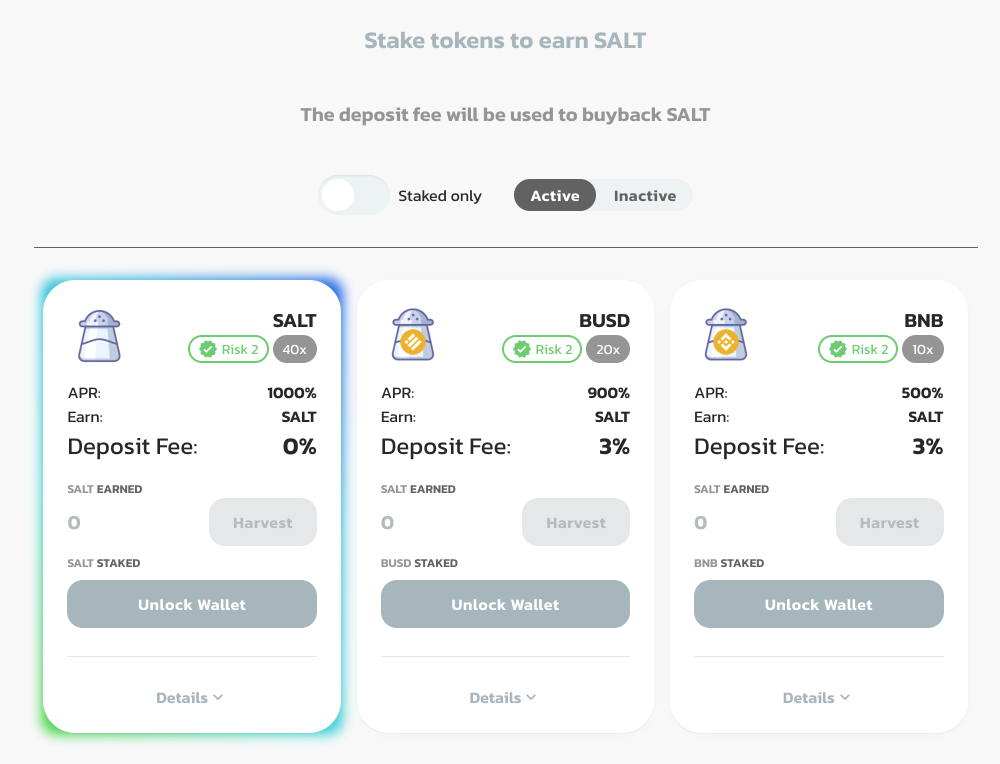

# Pools

[**SaltSwap pools** ](https://exchange.saltswap.finance/#/pool)allow you to provide liquidity by adding your tokens to liquidity pools or “LPs”.

When you add your token to a liquidity pool \(LP\), you will receive FLIP tokens \(SaltSwap version of liquidity provider tokens\).

As an example, if you deposited $SALT and $BNB into a liquidity pool, you would receive SALT-BNB FLIP tokens.

The number of FLIP tokens you receive represents your portion of the SALT-BNB liquidity pool. You can also redeem your funds at any time by removing your liquidity.

---

Providing liquidity is not without risk, as you may be exposed to impermanent loss.  
[“Simply put, impermanent loss is the difference between holding tokens in an AMM and holding them in your wallet.” - Nate Hindman](https://blog.bancor.network/beginners-guide-to-getting-rekt-by-impermanent-loss-7c9510cb2f22)

It's not all bad for liquidity providers as you will also be given a reward in the form of trading fees. Whenever someone trades SaltSwap, the trader pays a 0.2% fee, of which 0.17% is added to the liquidity pool of the swap pair they traded on.

For example:

- There are 10 FLIP tokens representing 10 SALT and 10 BNB tokens.
- 1 FLIP token = 1 SALT + 1 BNB
- Someone trades 10 SALT for 10 BNB.
- Someone else trades 10 BNB for 10 SALT.
- The SALT/BNB liquidity pool now has 10.017 SALT and 10.017 BNB.
- Each FLIP token is now worth 1.00017 SALT + 1.00017 BNB.

To make being a liquidity provider even more worth your while, you can also put your FLIP tokens to work whipping up some fresh yield on the [SALT farms \(here\)](https://www.saltswap.finance/farms), while still earning your 0.17% trading fee reward.
